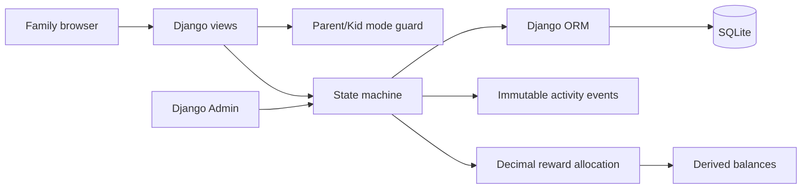

# Household Chores

   


Household Chores is a browser-based family chore board. Parents create, assign, approve, and pay out chores; children use Kid Mode to find work, claim chores, complete them, and submit requests.

The project is intentionally desktop-first and local-first. It uses SQLite, server-rendered Django templates, Django Admin for parent workflows, and HTMX for small interactive updates.

## Problem

Household chores are easy to discuss and surprisingly hard to coordinate. Families need one shared place to answer three questions: what needs doing, who is responsible, and what happens after it is finished. A spreadsheet can list work, but it does not enforce a lifecycle, preserve approval history, or handle shared chores and rewards cleanly.

This project turns that workflow into a small, understandable web application designed for a shared household device or a trusted home network.

## See it locally

There is no public deployment yet. Run the app locally and open the mode selector at [`http://127.0.0.1:8000/mode/`](http://127.0.0.1:8000/mode/). The local SVG above previews the visual language used by the app; the application itself provides the interactive board, dashboard, and admin workflows.

The shortest useful walkthrough is:

1. Enter Parent Mode and create a chore.
2. Choose Kid Mode for a child and claim the chore.
3. Complete it from the board.
4. Return to Admin, approve or reject it, and inspect the activity history.

For a shared chore, repeat the claim step as another child. Each claimant remains visible and receives an exact-cent reward share after approval.

## MVP status

The MVP checkpoint is complete through the multi-claimant shared-chore work. The delivered scope includes the core chore lifecycle, Parent/Kid Mode, the family board, child dashboard, requests, recurrence, payouts and balances, weekly limit warnings, activity history, and shared chores with multiple claimants.

Later GitHub issues are follow-up work outside this MVP checkpoint. They include items such as stronger concurrency handling, additional give-back UI, per-claim completion rules, and configurable reward-split rules.

## Quickstart

### Prerequisites

- Python 3.14 or newer
- [`uv`](https://docs.astral.sh/uv/)

```powershell
git clone https://github.com/ssudhindra-gg/household-chores-mvp.git
cd household-chores-mvp
uv sync
uv run python manage.py migrate
uv run python manage.py createsuperuser
uv run python manage.py runserver 127.0.0.1:8000
```

Then open <http://127.0.0.1:8000/mode/>. Use <http://127.0.0.1:8000/admin/> for the authenticated parent administration area.

The project has no required API keys, cloud services, containers, or external datasets. The default database is the repository-local `db.sqlite3` file.

## Features

### Family and child workflows

- Parent/Kid Mode is selected in the browser session; Kid Mode stores the active child.
- The family board shows chore title, category, priority, status, claimant(s), reward, and reminder state.
- Board filters support child, category, status, and priority, including safe handling of malformed filters.
- Children can claim and complete chores from Kid Mode.
- Shared chores can be claimed by multiple children. Claims retain their order, completion timestamp, and reward share.
- A child dashboard shows active assigned/claimed chores, available work, pending requests, completion history, payout history, and current derived balance.
- Children can submit requests for new chores.

### Parent workflows

- Parents create and edit chores through the custom chore editor.
- Django Admin supports approval and rejection actions; rejection requires a reason.
- Admin shows read-only claimant records and append-only activity history on a chore's change page.
- Admin supports payout recording while protecting payout history from edits and deletes.
- Weekly earning limits produce soft approval warnings rather than blocking approval.

### Chore lifecycle

The state machine uses these statuses:

```text
available --claim--> claimed --complete--> awaiting approval --approve--> approved
    ^                    |                         |
    |                    +--release--> available  +--reject--> returned
    +--------------------------- claim ---------------------------+
```

The important transitions are:

- `claim`: available or returned chores become claimed; shared chores may accept another claimant while already claimed.
- `complete`: a claimant submits the chore for approval.
- `approve`: a parent approves the submission and allocates any reward.
- `reject`: a parent returns the chore with a required reason.
- `release`: a claimant gives up the claim; a shared chore remains claimed while other claims remain.

When multiple children hold claims, completion and release identify the child explicitly. The legacy `assigned_child` column remains as the earliest-claim compatibility pointer, while `ChoreClaim` is the source of truth for new multi-claim behavior.

## Technical architecture

| Area | Implementation |
| --- | --- |
| Web framework | Django 6.0 |
| Database | SQLite |
| Interactivity | HTMX partial responses via `django-htmx` |
| Parent administration | Customized Django Admin |
| Dependency management | `uv` |
| Tests | Pytest with `pytest-django` |
| Currency math | `Decimal`, quantized to cents with `ROUND_HALF_UP` |

The main application is in the `chores` Django app. Domain rules are deliberately separated:

- `chores/models.py` contains the domain entities and thin transition methods.
- `chores/state_machine.py` is the single status-transition authority.
- `chores/rewards.py` allocates exact-cent shares for claimant sets.
- `chores/balances.py` derives earnings and unpaid balances from approved rows and payouts.
- `chores/payouts.py` validates append-only payout recording.
- `chores/recurrence.py` handles recurring chore generation and rotation.
- `chores/activity.py` records immutable transition events.
- `chores/modes.py` implements the session-scoped Parent/Kid Mode switch.
- `chores/views.py` and `chores/templates/` provide the board, dashboard, editors, and actions.
- `chores/admin.py` provides parent approval, rejection, payout, claimant, and activity workflows.

### Request and data flow



The state machine is the shared write boundary for board actions and parent workflows. The database stores the facts; balances and reminder labels are derived when needed.

## Data model

- `Child` — name, optional weekly earning limit, and relationships to chores, claims, payouts, and requests.
- `Chore` — title, notes, category, priority, due date, status, optional reward, assignment pointer, shared flag, recurrence links, and lifecycle timestamps.
- `ChoreClaim` — one unique child/chore claim with `claimed_at`, optional `completed_at`, and optional `reward_share`.
- `ChoreEvent` — immutable activity row for each successful state-machine transition, including actor mode and rejection reason.
- `Payout` — immutable money paid to a child.
- `RecurrenceRule` and `RotationSlot` — recurring schedules and ordered child rotation.
- `ChoreRequest` — child-submitted request awaiting a parent decision.

Balances are derived rather than stored. Approved claim reward shares are summed for claim-based chores; older approved chores without claim rows fall back to their chore reward and assigned child. Payouts are subtracted, and negative balances remain visible.

## Getting started

### Requirements

- Python 3.14 or newer
- [`uv`](https://docs.astral.sh/uv/)

### Install dependencies

From the repository root:

```powershell
uv sync
```

### Initialize the database

```powershell
uv run python manage.py migrate
```

Create an admin user for the parent-facing Django Admin:

```powershell
uv run python manage.py createsuperuser
```

### Run the development server

```powershell
uv run python manage.py runserver
```

Open the application at <http://127.0.0.1:8000/>. The main screens are:

| Screen | URL |
| --- | --- |
| Mode selection | `/mode/` |
| Family board | `/board/` |
| Kid dashboard | `/dashboard/` |
| Weekly summary | `/summary/weekly/` |
| Django Admin | `/admin/` |

The local development settings intentionally use `DEBUG=True`, a local SQLite database, and a development secret key. Review the Django deployment checklist before exposing the application beyond a trusted development network.

## Key routes

| Method | Route | Purpose |
| --- | --- | --- |
| `GET`, `POST` | `/mode/` | Select Parent or Kid Mode |
| `GET` | `/board/` | View and filter the family board |
| `GET` | `/dashboard/` | View the active child's dashboard |
| `GET`, `POST` | `/chores/new/` | Create a chore in Parent Mode |
| `GET`, `POST` | `/chores/<id>/edit/` | Edit a chore in Parent Mode |
| `POST` | `/chores/<id>/claim/` | Claim a chore in Kid Mode |
| `POST` | `/chores/<id>/complete/` | Submit a chore in Kid Mode |
| `POST` | `/chores/<id>/approve/` | Approve a chore in Parent Mode |
| `POST` | `/chores/<id>/reject/` | Reject a chore with a reason |
| `POST` | `/payouts/record/` | Record a parent payout |
| `GET`, `POST` | `/chore-requests/` | Submit a child chore request |

Write actions are POST-only and protected with Django CSRF. Mode guards prevent parent-only and kid-only actions from being used in the wrong session mode.

## Verification commands

Run the full test suite:

```powershell
uv run pytest
```

Run one test module:

```powershell
uv run pytest tests/test_smoke.py
```

Run the Django checks and migration check:

```powershell
uv run python manage.py check
uv run python manage.py makemigrations --check --dry-run
```

The MVP checkpoint currently verifies with 291 passing tests and 157 passing subtests.

The suite covers model transitions, shared-claim behavior, reward allocation, derived balances, migrations, board filters, Kid Mode actions, dashboard scoping, admin workflows, payouts, recurrence, and activity history.

There is currently no CI/CD workflow or public deployment. Verification is run locally before a logical commit and push.

## Project workflow

Work is organized around GitHub Issues. The intended lifecycle is:

1. Pick one open issue.
2. Groom its acceptance criteria.
3. Implement the issue.
4. Run QA against the acceptance criteria.
5. If QA fails, address the findings and repeat verification.
6. If QA passes, the orchestrator closes the issue.
7. Commit at logical points and push the verified work.

The process details live in [`_docs/process.md`](_docs/process.md). The architecture decision record is [`_docs/architecture.md`](_docs/architecture.md), and groomed task notes live in [`_docs/tasks/`](_docs/tasks/).

## Design decisions and trade-offs

- **Django over a smaller framework:** Django Admin covers parent approvals, filtering, search, and read-only history with little custom infrastructure.
- **SQLite over a hosted database:** the MVP should be easy to clone and run on a household machine. A production deployment would need a stronger database and deployment settings.
- **Derived balances over a stored counter:** recalculating from approved rewards and immutable payouts avoids drift between a balance and its source rows.
- **An assigned-child compatibility pointer plus `ChoreClaim`:** existing single-claim data remains readable while shared chores gain a normalized claim history.
- **Server-rendered templates plus HTMX:** the app stays simple to run while claim and completion actions can update one board row without a full-page refresh.

## Limitations and future work

- The application does not authenticate family members in the main UI; Parent/Kid Mode is a convenience boundary, not security. Django Admin still requires staff authentication.
- It is not configured for public production deployment: `DEBUG=True`, a development secret key, SQLite, and local static-file serving are intentional development defaults.
- Concurrent claims are not yet protected by a dedicated locking strategy.
- Give-back controls, per-claim completion policies, and configurable reward-split policies are planned follow-up work.
- There is no hosted demo, screenshot gallery, or automated CI pipeline yet.

These boundaries are explicit so the README distinguishes implemented behavior from planned work.

## Troubleshooting

| Symptom | Fix |
| --- | --- |
| `uv` is not recognized | Install `uv`, reopen the terminal, and rerun `uv sync`. |
| The app reports unapplied migrations | Run `uv run python manage.py migrate`. |
| Admin login fails | Create an account with `uv run python manage.py createsuperuser`; app mode selection is separate from Admin login. |
| Port 8000 is busy | Run `uv run python manage.py runserver 127.0.0.1:8001` and open the matching URL. |
| Static styles are missing | Confirm the server is running with `DEBUG=True` and reload the page. The CSS lives in `chores/static/chores/app.css`. |

## Repository layout

```text
.
├── chores/                  Django app, domain logic, views, templates, admin, migrations
├── household_chores/        Django project settings, URLs, WSGI/ASGI entry points
├── tests/                   Pytest/Django test suite
├── _docs/                   Process, architecture, and task documentation
├── manage.py                Django management entry point
├── pyproject.toml           Project metadata and dependencies
├── uv.lock                  Locked dependency versions
└── db.sqlite3               Local development database
```

Do not add dependencies without updating `pyproject.toml` and reviewing the project constraints in `AGENTS.md`.
